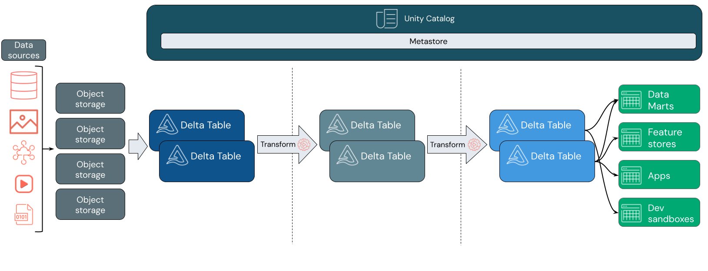

https://learn.microsoft.com/en-us/azure/databricks/lakehouse/

* goal
  * data lakehouse
    * architectural pattern
    * | Azure Databricks

* data lakehouse
  * == data management system / benefits of data lakes + benefits of data warehouses
    
  * uses
    * scalable storage
    * processing capabilities | DIFFERENT workloads (_Example:_ machine learning (ML), business intelligence (BI)) 
    * 1! source of truth
      * -> eliminate REDUNDANT costs
  * architecture
    * see [Medallion](lakehouse.medallion.md)

* TODO: