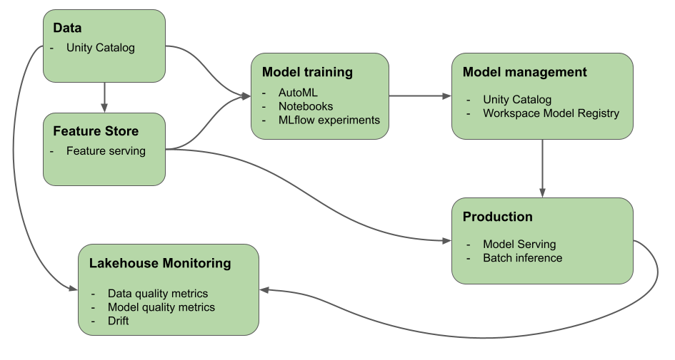

https://learn.microsoft.com/en-us/azure/databricks/machine-learning/

* goal
  * tools / 
    * -- provided by -- Mosaic AI
    * help you build AI & ML systems 

# Generative AI

* Generative AI
  * ⭐️:= artificial intelligence's type /
    * computers can -- via models -- create content (_Example:_ images, text, code, and synthetic data) ⭐️
  * 's applications
    * built | generative AI models ( == large language models (LLMs) + foundation models)
  * 's models OR foundation models
    * == large ML models pre-trained / 
      * 's goal == fine-tuned | MORE specific language understanding & generation tasks 
    * uses
      * 👀discern patterns | input data 👀
      * image generation -- based on -- EXISTING ones
      * speech tasks
        * _Example:_ transcription, translation, question/answer generation & interpretation of the text
    * lifecycle
      * learning processes + generate statistically probable outputs | prompted
  * design patterns
    * Prompt Engineering
      * == specialized prompts / -- guide -- LLM behavior
    * Retrieval Augmented Generation (RAG)
      * == LLM + external knowledge retrieval
    * Fine-tuning
      * == adapt a pre-trained LLM -- to specific -- data sets of domains
    * Pre-training
      * == train an LLM -- from -- scratch
  
* LLMs
  * == deep learning models / 
    * consume & train on massive datasets -- to excel in -- language processing tasks
    * create NEW combinations of text / mimic natural language -- based on -- their training data

* Mosaic AI
  * == PREVIOUS Databricks Machine Learning
  * 💡== Databricks Generative AI 💡
  * ⭐️== unifies AI lifecycle ⭐
    * ==️ data collection & preparation + model development + LLMOps 
  * optimized features -- to facilitate the -- development of generative AI apps
    * [Unity Catalog](data-governance.unity-catalog.md)
    * [MLflow](mlflow.tracking.md)
    * [Mosaic AI Gateway](ai-gateway.md)
    * [Mosaic AI Model Serving](machine-learning.model-serving.md)
    * [Mosaic AI Vector Search](generative-ai.vector-search.md)
    * [Lakehouse Monitoring](lakehouse-monitoring.md)
    * [AI Playground](large-language-models.ai-playground.md)
    * [Foundation Model Fine-tuning](large-language-models.foundation-model-training.md)
    * [Mosaic AI Agent Framework](generative-ai.retrieval-augmented-generation.md)
    * [Mosaic AI Agent Evaluation](generative-ai.agent-evaluation.md)

  * Databricks platform's products / help you
    * 👀implement your E2E workflows -- to -- build & deploy AI & ML systems 👀

# Support for multimodal generative AI models
* TODO:
 
# Machine learning on Databricks
* TODO:

# Deep learning on Databricks
* TODO: