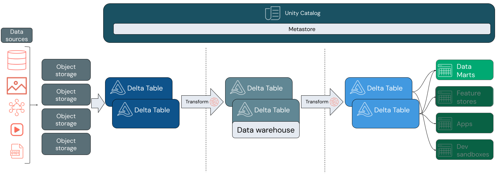

https://learn.microsoft.com/en-us/azure/databricks/sql/

* goal
  * data warehouse | YOUR data lakehouse 

* Data warehousing
  * == collecting & storing data -- from -- MULTIPLE sources
    * -> 👀it can be -- quickly accessed for -- business insights & reporting 👀 
  * | YOUR data lakehouse
    * [lakehouse architecture](lakehouse.md) + Databricks SQL -> 👀cloud data warehousing capabilities | YOUR data lakes 👀 
      * == 
        * you can model a highly-performant, cost-effective data warehouse / runs directly | your data lake -- via -- using familiar data structures, relations, and management tools
        * 1! source of truth
        * use certain features (_Example:_ Unity Catalog, Delta Lake)
  
  
    * vs traditional data warehouse
      * SAME goal
        * model data -- according to -- business requirements
        * serve data | your end users, -- for -- analytics and reports
      * avoid 
        * siloing your business analytics data or 
        * creating redundant copies

* TODO:
    